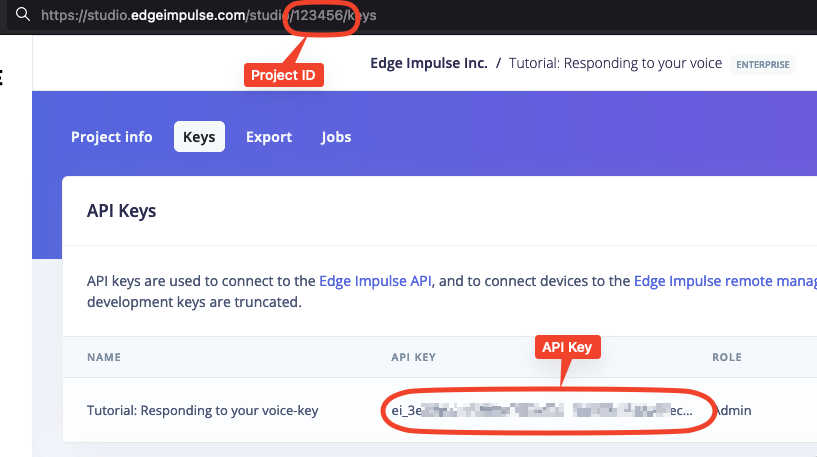

<p align="center">
  <a href="https://github.com/edgeimpulse/build-deploy/actions"></a>
</p>

# Edge Impulse Model Build & Deploy

GitHub Action to build and deploy your model from Edge Impulse Studio. This action allows you to integrate your ML models developed in Edge Impulse Studio with your CI/CD or test pipelines in GitHub.

## Usage

To use the action, simply provide Project ID, API key, and add `edgeimpulse/build-deploy` to your workflow. The action authenticates merely you in Edge Impulse Studio, runs the artifact build process, and downloads the deployment.
Depending on your `deployment_type` (in most cases, it will be `zip`, which is a C++ library with model and Edge Impulse SDK), you can use it later. The example below shows the default deployment (`zip`) and how to extract all parts of that.

```yaml
name: CI/CD

on:
  push:
    branches:
      - 'main'

jobs:
  build:
    runs-on: ubuntu-latest
    steps:
    - name: Checkout firmware source code
      uses: uses: actions/checkout@v3

    - name: Build and deploy Edge Impulse Model
      uses: edgeimpulse/build-deploy@v1
      # assing the ID so that you can use the output later
      id: build-deploy
      with:
        project_id: ${{ secrets.PROJECT_ID }}
        api_key: ${{ secrets.API_KEY }}

    - name: Extract the Model and SDK
      # here, we are using output that contains the downloaded file name
      run: |
        mkdir temp
        unzip -q "${{ steps.build-deploy.outputs.deployment_file_name }}" -d temp
        mv temp/edge-impulse-sdk/ .
        mv temp/model-parameters/ .
        mv temp/tflite-model/ .
        rm -rf "${{ steps.build-deploy.outputs.deployment_file_name }}"
        rm -rf temp/
```

## Customizing

### Inputs

The following inputs are available

| Name              | Required? | Description                                                   |
|-------------------|-----------|---------------------------------------------------------------|
| `project_id`      | YES       | Your project API key (see instruction below)                  |
| `api_key`         | YES       | Your project number (see instruction below)                   |
| `impulse_id`      | NO        | Impulse ID. If this is unset then the default impulse is used |
| `engine`          | NO        | Inferencing engine type. See [docs for details](https://docs.edgeimpulse.com/apis/studio/jobs/build-on-device-model#body-engine) |
| `deployment_type` | NO        | Type of the deployment, default is `zip`    |
| `model_type`      | NO        | Model type: `int8`, `float32`, `akida`                        |

### Outputs

The following outputs are available

| Name                   | Type   | Description                 |
|------------------------|--------|-----------------------------|
| `deployment_file_name` | string | Name fo the downloaded file |

## Setting Project ID and API Key from Edge Impulse Studio

To get the project ID and API key from Edge Impulse Studio, go to your project and select `Dashboard` in the left pane. Then choose `Keys` on top and copy values as shown below



Then set these values in your repository as [described here](https://docs.github.com/en/actions/security-guides/encrypted-secrets#creating-encrypted-secrets-for-a-repository).

## Contributing

Contributing is warmly welcome!
